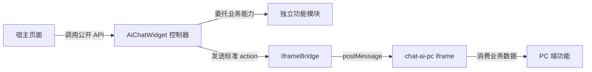
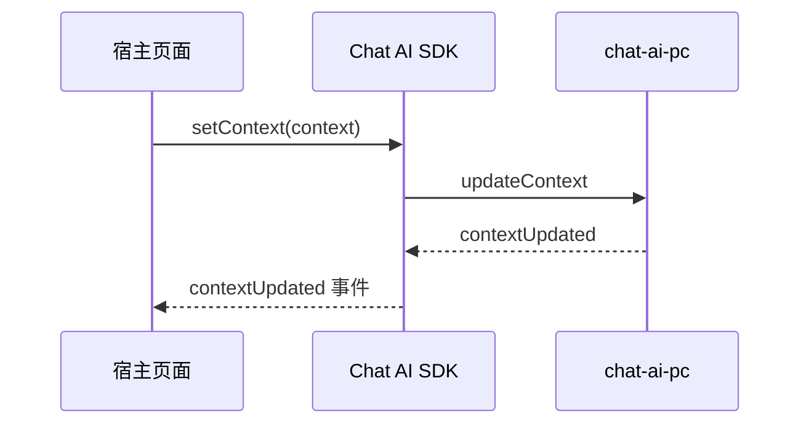
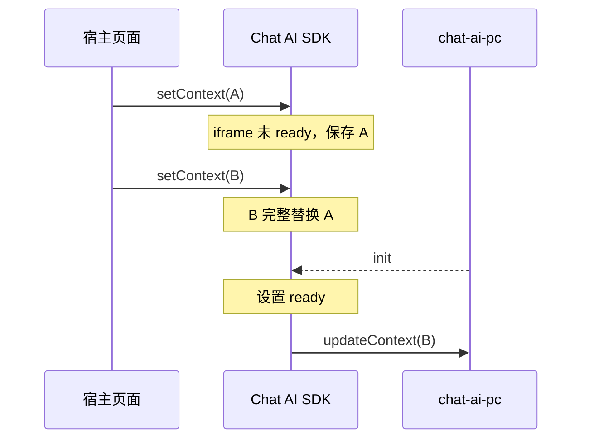

# Chat AI SDK 功能模块扩展指南

本文面向 SDK 维护者和二次开发人员，说明如何在不破坏现有架构边界的前提下，为 Chat AI SDK 增加独立功能模块。

文中的“页面上下文”模块是用于讲解扩展方法的模拟场景，相关 `setContext()`、`getContext()` 和 `updateContext` 协议当前并未在项目中实现，不能作为现有公开 API 使用。

SDK 当前的内核结构、状态机和通信协议请先参阅 [Chat AI SDK 内核架构](./README.md)。

## 扩展目标

一个完整的 SDK 功能通常会跨越以下层次：



扩展时应保持以下边界：

- 公开 API 只负责向接入方提供稳定入口，不暴露内部实例。
- `AiChatWidget` 负责编排生命周期、状态机和模块协作。
- 独立功能模块负责自身的数据校验、状态保存和业务规则。
- `IframeBridge` 只负责 iframe DOM 与消息传输，不解释业务数据。
- `chat-ai-pc` 负责消费 iframe 内部业务状态，不反向操作 SDK DOM。
- 新功能不得绕过控制器直接建立宿主页面与 iframe 业务模块之间的隐式依赖。

## 什么时候需要独立模块

不是每个新增方法都需要创建文件。满足以下任一条件时，可以考虑拆分独立模块：

- 功能拥有需要跨调用保存的独立状态。
- 功能包含明确且可单独描述的校验或转换规则。
- 同一业务逻辑已经出现第二次，并且后续会稳定复用。
- 功能会同时影响公开 API、ready 时序和 iframe 通信。
- 控制器中的相关代码已经形成可独立命名的职责单元。

以下情况通常不需要拆分：

- 只有一次简单的字段赋值。
- 逻辑只服务于控制器内部的单个状态切换。
- 尚未确定复用方向，仅为了减少文件行数。
- 模块拆分后仍需要频繁读取或修改控制器的大量内部状态。

判断标准不是代码行数，而是功能是否拥有稳定、独立的责任边界。

## 标准实施流程

新增功能模块时，建议按以下顺序设计和实施：

1. 定义宿主页面真正需要的使用场景和公开 API。
2. 明确输入类型、默认值、非法输入处理和返回值。
3. 判断功能在 iframe ready 前后的行为是否一致。
4. 确定模块需要保存的最小状态，以及状态由谁拥有。
5. 定义 SDK 与 iframe 之间的 action、方向和 data 结构。
6. 将公开 API 绑定到控制器，由控制器编排模块和通信桥。
7. 在 `chat-ai-pc` 增加对应的消息消费逻辑。
8. 补充架构文档、接入文档和 Demo，并列出兼容性边界。
9. 按功能风险设计 ready 前后、重复调用和异常输入的验收场景。

不要先创建工具类或通用抽象，再寻找使用位置。先确定一个完整的垂直场景，再提取已经稳定的职责。

## 模拟场景：页面上下文模块

### 业务背景

宿主页面希望在打开会话前，将当前页面的业务信息传给机器人，例如商品、订单或工单信息：

```js
AiChatSDK.setContext({
  pageType: 'order-detail',
  orderId: 'ORDER_10001',
  title: '订单详情'
})

AiChatSDK.open()
```

接入方还希望能够读取 SDK 当前保存的上下文：

```js
const context = AiChatSDK.getContext()
```

这个场景包含独立状态、输入校验、ready 前缓存和 iframe 同步，适合作为独立模块。

### 公开 API 契约

模拟新增以下方法：

```js
AiChatSDK.setContext(context)
AiChatSDK.getContext()
```

建议约束如下：

| 项目 | 约束 |
| --- | --- |
| `context` | 必须是可序列化的普通对象 |
| 数组、函数、DOM 节点 | 视为无效输入，输出警告并保持原状态 |
| ready 前调用 | 保存最后一次有效数据，ready 后自动同步 |
| ready 后调用 | 保存数据并立即发送给 iframe |
| 重复调用 | 后一次完整替换前一次，上下文不做隐式深度合并 |
| `getContext()` | 返回数据副本，避免接入方直接修改模块内部状态 |
| 未设置时 | 返回空对象 `{}` |

“完整替换”比默认深度合并更容易预测。如果业务确实需要增量更新，应另行设计 `updateContext(partialContext)`，不要让 `setContext()` 同时具备两种语义。

### 文件职责

模拟实施时涉及的文件可以按以下方式划分：

| 文件 | 改动职责 |
| --- | --- |
| `lib/src/context-module.js` | 校验、复制和保存页面上下文 |
| `lib/src/ai-chat.js` | 暴露 API，编排 ready 时序并调用通信桥 |
| `chat-ai-pc/src/event/index.ts` | 接收 `updateContext` action |
| `chat-ai-pc` 对应状态模块 | 保存上下文并提供给会话业务使用 |
| 根目录 `README.md` | 记录公开 API 与接入示例 |
| `lib/README.md` | 更新内核模块表和 iframe 协议 |
| Demo | 提供可手动操作的调用示例 |

`IframeBridge` 已具备通用 `send(action, data)` 能力时，不应为 `updateContext` 增加业务专属方法。通信桥不需要知道“页面上下文”的含义。

### 功能模块设计

`context-module.js` 只管理页面上下文本身，不读取 iframe、悬浮按钮或控制器状态。下面是职责示意，不是可直接复制的项目实现：

```js
class ContextModule {
  constructor() {
    this.context = {}
  }

  set(context) {
    if (!isSerializablePlainObject(context)) {
      console.warn('[AiChatSDK] context must be a serializable plain object')
      return false
    }

    this.context = cloneContext(context)
    return true
  }

  get() {
    return cloneContext(this.context)
  }
}
```

实现时需要明确“可序列化普通对象”的统一判断方式，避免校验通过后在 `postMessage` 阶段才因函数、循环引用等数据报错。复制策略也应与允许的数据类型保持一致。

如果当前项目只有这一处需要复制和校验，不要提前建立全局通用工具库；先将逻辑保留在模块内部。出现第二个稳定使用场景后，再评估提取公共函数。

### 控制器集成

控制器负责把模块状态与 iframe 生命周期连接起来：

```js
class AiChatWidget {
  constructor() {
    this.contextModule = new ContextModule()
  }

  setContext(context) {
    const changed = this.contextModule.set(context)

    if (changed && this.ready) {
      this.iframeBridge.send('updateContext', this.contextModule.get())
    }
  }

  getContext() {
    return this.contextModule.get()
  }

  handleInit(data) {
    // 完成现有 ready 初始化后，再同步 ready 前保存的功能状态。
    this.iframeBridge.send('updateContext', this.contextModule.get())
  }
}
```

在 `init()` 返回的公开对象中增加绑定后的方法：

```js
return {
  open: this.open.bind(this),
  close: this.close.bind(this),
  setConfig: this.setConfig.bind(this),
  setContext: this.setContext.bind(this),
  getContext: this.getContext.bind(this),
  on: this.on.bind(this),
  onReady: this.onReady.bind(this),
  isReady: this.isReady.bind(this)
}
```

控制器只编排以下事情：

- 调用模块校验并保存状态。
- 根据 `ready` 决定立即发送还是等待初始化。
- 在 iframe 初始化完成后同步缓存状态。
- 通过 `IframeBridge.send()` 发送协议消息。

数据校验、复制和业务默认值仍由功能模块负责，不能散落在控制器的多个 action 分支中。

### iframe 协议

模拟新增 SDK 到 iframe 的消息：

| action | data | 方向 | ready 依赖 |
| --- | --- | --- | --- |
| `updateContext` | 页面上下文普通对象 | SDK → iframe | ready 后发送；ready 前保留最后一次有效值 |

消息结构沿用现有协议：

```js
{
  action: 'updateContext',
  data: {
    pageType: 'order-detail',
    orderId: 'ORDER_10001'
  }
}
```

`chat-ai-pc` 收到 action 后，应将数据交给自己的状态模块或业务服务。事件入口只负责分发，不应在 `event/index.ts` 中堆积机器人提示词拼装等具体业务逻辑。

### 是否需要新增事件

页面上下文成功保存在 SDK 内部，并不等于 iframe 业务已经消费完成。因此不要为了 API 对称性直接新增 `contextChange` 事件。

只有接入方确实需要知道 iframe 已经处理完成时，才设计确认协议：



增加确认事件前必须明确：

- “完成”代表收到消息、写入状态，还是已经影响下一轮会话。
- iframe 未返回确认时是否超时。
- 连续更新时如何区分每次请求。
- 接入方是否真的需要处理该结果。

如果没有明确消费场景，单向同步已经足够，不应增加 request id、Promise 或确认事件。

### ready 与调用时序

页面上下文模块应复用 SDK 已有 ready 状态，不建立第二套初始化状态：



建议在 ready 初始化流程中固定同步顺序。若上下文必须在 `openWindow` 前到达，应先同步上下文，再处理待执行的 `open()`。这属于业务协议约束，需要通过原因型注释和文档明确，不能依赖两个 `postMessage` 恰好按某段代码的当前顺序出现。

### 验收场景

模拟功能实施后至少检查：

- 未设置上下文时，现有 SDK 行为不变。
- ready 前设置一次上下文，收到 `init` 后同步该数据。
- ready 前连续设置多次，只同步最后一次有效数据。
- ready 后设置上下文，立即发送 `updateContext`。
- 非普通对象、不可序列化对象不会覆盖上一次有效状态。
- `getContext()` 返回副本，外部修改不会污染内部状态。
- iframe 正确消费上下文，未知 action 不影响其他消息。
- 上下文同步发生在依赖它的 `openWindow` 之前。
- 不同来源的宿主页面消息仍经过 `IframeBridge` 的 origin 校验。
- 根 README、内核架构文档和 Demo 与实际 API 保持一致。

## 设计规则

### API 命名

- 对外方法使用 camelCase，并以明确动词开头，如 `setContext()`。
- 读取方法不产生副作用，如 `getContext()`。
- 可选参数优先使用对象，避免不断增加位置参数。
- 不将内部模块实例、DOM 节点或 iframe 引用暴露给接入方。
- 新 API 的非法输入应告警并安全返回，不能中断宿主页面。

### 状态归属

- 一个状态只设置一个主要所有者。
- 控制器保存跨模块生命周期状态，如 `ready` 和 `opened`。
- 功能模块保存自身业务状态，如页面上下文。
- iframe 内部状态由 `chat-ai-pc` 管理，不在 SDK 中复制不必要的业务细节。
- 需要跨边界同步时，通过显式 action 完成，不共享可变对象。

### 协议设计

- action 使用可读、稳定的 camelCase 名称。
- 每个 action 只表达一个方向明确的动作。
- data 必须可被结构化克隆，字段含义需要写入文档。
- 明确 action 是否依赖 ready，以及重复发送是否安全。
- 需要双向确认时使用不同 action 名称，避免一个名称承担请求和响应两种语义。
- SDK 发送消息统一经过 `IframeBridge.send()`；原始消息统一由 `IframeBridge` 接收和校验。

### 配置、方法和事件的选择

| 能力 | 适用场景 | 示例 |
| --- | --- | --- |
| 配置 | 控制 SDK 的持续行为或展示策略 | `showFloatButton` |
| 方法 | 接入方主动执行动作或更新数据 | `open()`、模拟的 `setContext()` |
| 事件 | SDK 中发生了接入方需要响应的状态变化 | `ready`、`open`、`close` |
| iframe action | SDK 与会话页面之间传递动作或数据 | `openWindow`、模拟的 `updateContext` |

不要为同一能力同时提供配置、方法和事件三套入口。先根据使用语义选择最小且稳定的公开表面。

## 注释与文档要求

新增模块时，注释应重点解释无法从代码本身看出的原因：

- 为什么必须在 ready 后发送。
- 为什么同步顺序需要早于 `openWindow`。
- 为什么某类输入不允许透传。
- 为什么状态采用覆盖而不是合并。
- 为兼容历史接入保留了什么默认行为。

不要为构造函数赋值、简单 getter 或方法名已经表达清楚的调用增加无信息量注释。

文档应按影响范围更新：

- 公开 API、参数和接入示例更新根目录 `README.md`。
- 内部模块边界、状态机和协议更新 `lib/README.md`。
- 通用扩展方法和完整示例更新本文档。
- 可操作能力更新 Demo，保证接入方可以看到真实调用方式。

## 常见问题

### 功能模块可以直接调用 `window.AiChatSDK` 吗

不可以。`window.AiChatSDK` 是提供给宿主页面的公开门面。内部模块由控制器直接调用，否则会形成全局依赖并使初始化和测试边界变得模糊。

### 功能模块可以直接调用 `iframe.contentWindow.postMessage` 吗

不可以。所有 iframe DOM 和原始消息操作都由 `IframeBridge` 管理，以便统一处理来源校验、ready 状态和未来的清理逻辑。

### 新功能是否都要增加生命周期事件

不需要。只有接入方存在明确响应需求时才增加事件。内部状态变化可以通过模块和控制器协作完成，无须扩大公开 API。

### ready 前是否为每次调用建立队列

取决于业务语义。状态设置类 API 通常保留最后一次值；不可丢失的命令才需要队列。选择队列前应明确容量、顺序、去重和失败处理。

### 是否应该立即抽取通用基类

通常不需要。先完成一个边界清晰的模块；当第二个模块出现相同且稳定的生命周期或校验模式时，再基于真实重复提取公共能力。

## 实施检查清单

### 设计阶段

- [ ] 使用场景和公开 API 已明确。
- [ ] 输入、输出、默认值和无效输入行为已明确。
- [ ] ready 前后行为及重复调用语义已明确。
- [ ] 状态所有者和模块边界已明确。
- [ ] iframe action 的方向和 data 结构已明确。
- [ ] 已判断是否真的需要新事件或确认协议。

### SDK 实施

- [ ] 公开 API 只通过 `AiChatWidget.init()` 的返回对象暴露。
- [ ] 功能状态由独立模块或明确的单一位置管理。
- [ ] 控制器只负责编排生命周期和模块协作。
- [ ] iframe 通信统一经过 `IframeBridge`。
- [ ] ready 前缓存和 ready 后同步复用现有状态机。
- [ ] 无效输入不会破坏已有状态或向宿主页面抛出异常。
- [ ] 新增监听器和 DOM 资源具备清理路径。

### iframe 业务端实施

- [ ] SDK 与 `chat-ai-pc` 的 action 名称完全一致。
- [ ] 消息入口只分发，具体业务逻辑进入对应状态或服务模块。
- [ ] 重复消息不会造成不可控的重复副作用。
- [ ] 未知或无效 data 不影响其他消息处理。

### 文档与验收

- [ ] 根 README 已记录真实公开 API。
- [ ] `lib/README.md` 已更新模块边界和通信协议。
- [ ] Demo 已提供真实、可理解的调用示例。
- [ ] 兼容性默认值和已知边界已记录。
- [ ] ready 前后、重复调用、非法输入和跨端同步场景均有验收项。

完成以上检查后，新功能才算形成从接入 API 到 iframe 业务消费的完整垂直能力，而不只是 SDK 内部新增了一个文件。
