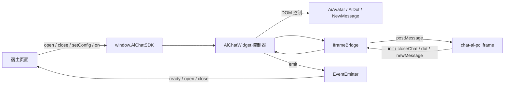
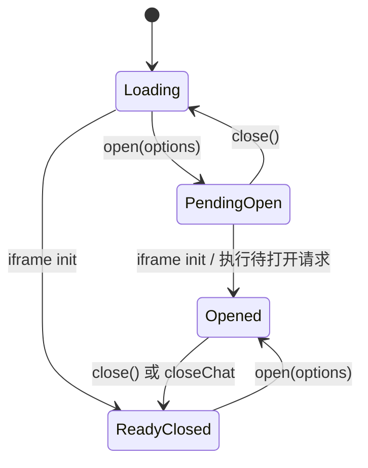

# Chat AI SDK 内核架构

本文面向 SDK 维护者和二次开发人员，说明 `lib` 内部的模块边界、运行时状态、通信协议和扩展约束。

接入代码、公开 API 示例和本地 Demo 使用方式请参阅项目根目录的 [README.md](../README.md)。

## 相关文档

- [功能模块扩展指南](./FEATURE-MODULE-GUIDE.md)：说明如何判断模块边界，并通过“页面上下文”场景演示公开 API、SDK 内核和 iframe 业务端的完整扩展过程。

## 设计目标

Chat AI SDK 负责在宿主页面中加载会话 iframe，并向接入方提供稳定的 JavaScript API。内核设计遵循以下原则：

- 宿主页面不直接操作 iframe DOM 和通信协议。
- SDK 文件执行完成后立即暴露公开 API，不要求等待 iframe ready。
- iframe 初始化时序由 SDK 内部状态机消化。
- 悬浮按钮只是默认入口，自定义入口与默认入口共享相同的打开逻辑。
- 对外配置和事件保持最小集合，未知输入只告警，不中断宿主页面。
- 现有接入未提供新配置时保持原有行为。

## 架构概览



### 分层职责

| 模块 | 职责 |
| --- | --- |
| `main.js` | 加载 SDK 样式，初始化内核，将公开 API 挂载到 `window.AiChatSDK` |
| `src/index.js` | 读取 script 配置、计算 iframe 地址、拆分 SDK 配置与 iframe 参数 |
| `src/ai-chat.js` | 核心控制器，管理状态机、公开 API、生命周期触发和消息 action 分发 |
| `src/event-emitter.js` | 管理生命周期事件的订阅、派发、取消订阅、异步回放和监听器异常隔离 |
| `src/iframe-bridge.js` | 管理 iframe DOM、尺寸位置、本地偏好、拖拽缩放、来源校验、消息监听、发送和清理 |
| `src/ai-avatar.js` | 管理悬浮按钮 DOM、位置、拖拽和持久显隐状态 |
| `src/ai-dot.js` | 管理未读红点 |
| `src/new-message.js` | 管理新消息提示 |
| `src/util.js` | query 序列化和 SDK 样式加载 |

内核当前以单例方式运行，并使用固定 DOM ID。一个宿主页面只支持一个 SDK 实例。

依赖方向保持单向：`AiChatWidget` 调用 `IframeBridge`、`EventEmitter` 和悬浮入口模块；`AiAvatar` 通过注入的点击回调请求打开会话，不反向导入控制器。`EventEmitter` 不感知 iframe 或窗口业务状态。

## 启动过程

宿主页面通过带有 `id="ai_chat_js"` 的 script 加载 SDK。启动顺序如下：

```text
SDK 文件执行
  → loadCss()
  → 读取 data-json
  → 生成 iframe 地址和 query
  → 创建隐藏 iframe
  → 注册 window.message 监听
  → 返回公开 API
  → window.AiChatSDK = API
  → iframe 异步初始化
  → iframe 发送 init
  → SDK 进入 ready 状态
```

`window.AiChatSDK` 在 iframe ready 前已经存在，因此接入方可以提前调用 `open()`、`setConfig()` 或注册 `onReady()`。

SDK 不处理脚本文件尚未下载执行、`window.AiChatSDK` 还不存在时的调用。若未来需要支持这一阶段，应在宿主接入片段中增加独立的 API 占位队列，而不是在 iframe 状态机中处理。

## 配置模型

### 初始化配置

初始化配置来自 script 的 `data-json`：

```js
{
  robot_key: 'YOUR_ROBOT_KEY',
  language: 'zh-CN',
  show_float_button: false
}
```

`src/index.js` 将配置拆分为两类：

- iframe 参数：转换为 query 后传入会话页面。
- SDK 配置：只在 SDK 内部消费，不传入 iframe。

当前 SDK 专属初始化字段：

| 外部字段 | 内部字段 | 默认值 |
| --- | --- | --- |
| `show_float_button` | `showFloatButton` | `true` |

为了兼容历史接入，`show_float_button` 缺失时默认显示悬浮按钮；`false`、`0` 和 `'0'` 均按隐藏处理。

### 运行时配置

运行时配置通过以下两种方式设置：

```js
AiChatSDK.setConfig('showFloatButton', false)
```

```js
AiChatSDK.setConfig({
  showFloatButton: false
})
```

当前只允许 `showFloatButton: boolean`。运行时配置覆盖初始化配置，并立即同步悬浮按钮状态。

配置行为：

- 设置为 `false` 时隐藏悬浮按钮，并清除红点和新消息提示。
- 设置为 `true` 且窗口关闭时显示悬浮按钮。
- 窗口打开期间设置为 `true`，按钮仍保持隐藏，关闭窗口后再显示。
- ready 前设置的值会在收到 iframe `init` 时应用。

不要通过 `setConfig()` 修改 `robot_key`、iframe 地址等初始化参数。这类字段会影响 iframe 生命周期，需要独立的重建协议。

### iframe 边界配置与本地偏好

iframe 容器的初始边界由会话页通过 `init` 消息中的 `config` 下发，包含 `iframe_width`、`iframe_height`、`iframe_right` 和 `iframe_bottom`。`IframeBridge.applyConfig()` 会先规范管理端配置，再读取宿主页面 `localStorage` 中的访客偏好，最终按以下优先级确定边界：

```text
本地有效缓存
  → 管理端 external_config_pc
  → SDK DEFAULT_BOUNDS
  → 当前视口边界修正
```

缓存内容为 `width`、`height`、`right`、`bottom`，使用 `zm_chat-wiki-iframe-bounds:<robot_key>` 作为键。按 `robot_key` 隔离是为了避免同一宿主域名接入多个机器人时相互覆盖；缺少机器人标识时回退到不带后缀的基础键。

拖拽或缩放正常触发 `pointerup` 后写入缓存。交互取消、Pointer Capture 丢失或窗口失焦只清理临时状态，不覆盖最近一次有效缓存。读取失败、字段无效或浏览器限制 `localStorage` 时静默回退，不能因此阻断 SDK 初始化和交互。

本地优先只适用于四个边界字段。`iframe_drag_enabled` 和 `iframe_resize_enabled` 属于管理端权限开关，每次初始化仍使用最新下发值，不从本地缓存读取。窗口关闭、SDK DOM 清理和重新初始化不会删除访客偏好。

## 状态机

核心状态位于 `AiChatWidget`：

| 状态 | 含义 |
| --- | --- |
| `ready` | 是否收到 iframe 的 `init` 消息 |
| `opened` | 会话窗口是否已经实际打开 |
| `desiredOpen` | ready 前是否收到打开请求 |
| `pendingOpenOptions` | ready 前最后一次 `open(options)` 参数 |
| `runtimeConfig` | 当前运行时配置 |
| `initData` | iframe 返回的机器人和界面配置 |



### 打开规则

- ready 前调用 `open()` 只记录期望状态，不提前显示未初始化的 iframe。
- ready 前多次调用以最后一次 `options` 为准。
- ready 后调用会隐藏悬浮按钮、显示 iframe，并发送 `openWindow`。
- 已打开时重复调用保持幂等，不重复发送消息或触发事件。
- `options` 必须是可序列化的普通对象，当前只透传，不解释业务字段。

### 关闭规则

- ready 前调用 `close()` 会取消待执行的打开请求。
- SDK 主动关闭时向 iframe 发送 `closeWindow`。
- iframe 内关闭按钮通过 `closeChat` 通知 SDK。
- 只有从打开状态实际切换到关闭状态时才触发 `close` 事件。
- 关闭后是否恢复悬浮按钮由 `showFloatButton` 决定。

## 公开 API

`AiChatWidget.init()` 返回绑定过实例上下文的公开方法：

```js
{
  open,
  close,
  setConfig,
  on,
  onReady,
  isReady
}
```

### API 稳定性约束

- 公开方法只能通过返回对象暴露，不应将 `AiChatWidget` 实例整体挂到 `window`。
- 新增参数优先使用对象，避免增加位置参数。
- 公共字段使用 camelCase；script 初始化字段保持现有 snake_case 风格。
- 无效参数输出 `console.warn` 并安全返回，不能让异常冒泡到宿主页面。
- 对现有方法增加返回值时，不得改变接入方忽略返回值时的行为。

## 事件模型

生命周期事件统一由 `EventEmitter` 管理，不在控制器或其他模块中维护零散的监听数组，也不通过 `window.dispatchEvent` 暴露 DOM 自定义事件。

`EventEmitter` 内部使用 `Map<string, Set<Function>>` 保存监听器，负责支持事件校验、回调校验、去重订阅、取消订阅、派发快照和监听器异常隔离。它是 SDK 内部模块，不作为新的公开 API 暴露。

支持的事件：

| 事件 | 数据 | 语义 |
| --- | --- | --- |
| `ready` | `{ type: 'ready' }` | iframe 完成业务初始化 |
| `open` | `{ type: 'open', options }` | SDK 实际显示会话窗口 |
| `close` | `{ type: 'close', source }` | 会话窗口实际关闭 |

其中 `close.source` 为：

- `sdk`：接入页面调用 `AiChatSDK.close()`。
- `iframe`：用户在 iframe 会话窗口内关闭。

订阅方式：

```js
const off = AiChatSDK.on('open', callback)
off()
```

事件规则：

- `ready` 是一次性、可回放的状态事件；ready 后订阅会异步执行一次。
- `open` 和 `close` 是瞬时事件，不回放历史记录。
- 同一事件下相同函数引用通过 `Set` 去重。
- `on()` 返回取消监听函数，不额外暴露 `off()`。
- 单个监听器异常会被捕获，不能阻断其他监听器。
- `onReady(callback)` 是 `on('ready', callback)` 的便捷封装。
- `isReady()` 只用于同步查询，不应被接入方用于轮询。

`ready` 是否已经发生由 `AiChatWidget` 的状态机判断；`EventEmitter` 只负责执行异步回放及异常隔离。首次 `ready` 派发完成后，控制器会清理该事件的一次性监听器，但继续保留 `ready` 状态，用于处理后注册的监听器。`open`、`close` 不传入回放选项。

当前事件中心刻意保持最小能力，不增加 `once()`、通配符、优先级或公开的 `off()`、`destroy()`。如果未来确有多个稳定场景，再按实际需要扩展。

## iframe 通信协议

### SDK 发送给 iframe

| action | data | 说明 |
| --- | --- | --- |
| `openWindow` | `open(options)` 参数 | 通知 iframe 进入打开状态 |
| `closeWindow` | `{}` | 通知 iframe 进入关闭状态 |

### iframe 发送给 SDK

| action | data | 说明 |
| --- | --- | --- |
| `init` | `{ robot, config }` | 会话业务初始化完成 |
| `closeChat` | - | iframe 内主动关闭 |
| `dot` | 未读数量 | 更新红点 |
| `newMessage` | 消息列表 | 更新新消息提示 |

`IframeBridge` 是唯一注册原始 `window.message` 的模块。它完成来源校验后，将 `event.data` 交给 `AiChatWidget.handleMessage()` 集中分发。新增协议时应继续保持这个单一入口。

### 来源校验

`IframeBridge` 根据 `iframeSrc` 计算预期 origin，并在消息进入控制器前拒绝其他来源。

当前发送端的 `targetOrigin` 仍为 `'*'`。如进行安全加固，应同时调整 SDK 和 iframe 两端，并保证开发、预览和生产域名均能正确计算；不要只改单侧导致通信中断。

## 悬浮入口协作

`AiAvatar` 维护两种不同状态：

- `enabled`：配置是否允许显示悬浮按钮。
- DOM `display`：当前交互状态是否需要临时隐藏。

窗口打开时，即使 `enabled === true`，按钮也会临时隐藏；窗口关闭后再由 `enabled` 决定是否恢复。

`AiDot` 和 `NewMessage` 依赖 `AiAvatar.avatarContentEl`。因此：

- 容器不存在时必须安全返回。
- `showFloatButton === false` 时不得创建提示。
- 动态隐藏时必须移除已经存在的提示。

默认悬浮按钮通过控制器注入的点击回调调用 `AiChatWidget.open()`；宿主页面自定义入口通过公开 API 调用同一方法。两种入口不能各自维护打开逻辑。

## 扩展规范

### 新增运行时配置

新增配置时需要同步检查：

1. 初始化字段与内部字段的映射。
2. `setConfig()` 的白名单和类型校验。
3. ready 前缓存和 ready 后动态应用行为。
4. 是否影响打开、关闭或悬浮入口状态。
5. 缺省值对历史接入的兼容性。
6. 根 README 和 Demo 是否需要同步更新。

### 新增事件

新增事件时需要明确：

1. 是状态事件还是瞬时事件。
2. 是否允许历史回放。
3. 触发点代表“收到请求”还是“状态实际改变”。
4. 事件 payload 的稳定字段。
5. 幂等调用是否重复触发。
6. 在控制器的支持事件列表中注册，并统一通过 `EventEmitter` 订阅和派发。

### 新增 iframe action

新增 action 时应明确发送方向、data 结构和 ready 依赖，并同时更新 SDK、`chat-ai-pc` 与本文档。不要绕过 `IframeBridge.send()` 直接访问 iframe 的 `contentWindow`。

## 已知边界

- 仅支持单 SDK 实例。
- 不支持 SDK 脚本执行前的 API 调用队列。
- 不支持运行时更换机器人或 iframe 地址。
- `open(options)` 当前只透传参数，iframe 尚未消费具体业务字段。
- SDK 没有独立的销毁 API；如未来支持 SPA 多实例挂载，需要统一清理 iframe、悬浮 DOM、message 监听和事件订阅。

## 维护检查清单

修改 SDK 内核时至少确认：

- 未改变旧配置缺省行为。
- ready 前后的 API 行为一致。
- `open`、`close` 状态变化保持幂等。
- 悬浮按钮配置不会被关闭流程意外覆盖。
- 未读提示不会访问未初始化的 DOM。
- 新增监听器具备清理路径。
- 生命周期事件只通过 `EventEmitter` 订阅和派发。
- `AiAvatar` 不反向依赖 `AiChatWidget`。
- 原始 `window.message` 和 iframe DOM 操作只存在于 `IframeBridge`。
- iframe action 在两端命名一致。
- 根 README、Demo 和本架构文档保持同步。
